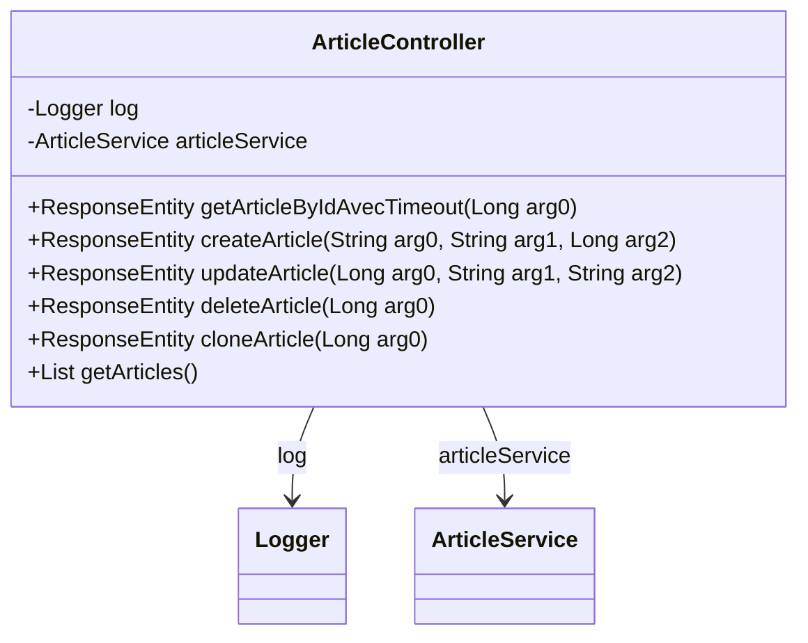

# ArticleController

API de gestion des articles permettant de :
- Lister tous les articles
- Récupérer un article par son ID (avec timeout de 2 secondes)
- Créer un nouvel article associé à un auteur
- Mettre à jour le contenu d'un article
- Supprimer un article
- Cloner un article existant

Chaque article possède un titre, un contenu et est associé à un auteur.
Les opérations de lecture sont optimisées avec des timeouts pour garantir la réactivité.

## Diagramme de Classe

## Methods

### getArticleByIdAvecTimeout

**Résumé :** Récupérer un article par ID avec timeout

**Description :** Récupère les informations détaillées d'un article spécifique en utilisant son identifiant unique. L'opération est limitée à 2 secondes pour garantir la réactivité du système.

#### Parameters

- `id` : ID de l'article à récupérer

#### Responses

- `200` : Article trouvé
- `404` : Article non trouvé
- `408` : Délai d'attente dépassé
- `500` : Erreur interne du serveur

### createArticle

**Résumé :** Créer un nouvel article

**Description :** Crée un nouvel article dans le système et l'associe à un auteur existant. L'article sera immédiatement disponible pour consultation.

#### Parameters

- `title` : Titre de l'article
- `content` : Contenu de l'article
- `authorId` : ID de l'auteur

#### Responses

- `201` : Article créé avec succès
- `400` : Données invalides
- `404` : Auteur non trouvé
- `500` : Erreur interne du serveur

### updateArticle

**Résumé :** Mettre à jour un article

**Description :** Met à jour le contenu d'un article existant. Les modifications sont appliquées immédiatement et conservent la référence à l'auteur original.

#### Parameters

- `id` : ID de l'article à mettre à jour
- `title` : Nouveau titre de l'article
- `content` : Nouveau contenu de l'article

#### Responses

- `200` : Article mis à jour avec succès
- `404` : Article non trouvé
- `500` : Erreur interne du serveur

### deleteArticle

**Résumé :** Supprimer un article

**Description :** Supprime définitivement un article du système. Cette action ne supprime pas l'auteur associé à l'article.

#### Parameters

- `id` : ID de l'article à supprimer

#### Responses

- `204` : Article supprimé avec succès
- `404` : Article non trouvé
- `500` : Erreur interne du serveur

### cloneArticle

**Résumé :** Cloner un article

**Description :** Crée une copie exacte d'un article existant. Le clone aura le même contenu et le même auteur que l'article original mais un nouvel ID unique.

#### Parameters

- `id` : ID de l'article à cloner

#### Responses

- `201` : Article cloné avec succès
- `404` : Article non trouvé
- `500` : Erreur interne du serveur

### getArticles

**Résumé :** Récupérer tous les articles

**Description :** Récupère la liste complète des articles disponibles dans le système. Les articles sont retournés avec leurs informations détaillées et les références à leurs auteurs.

#### Responses

- `200` : Liste des articles récupérée avec succès
- `500` : Erreur interne du serveur

