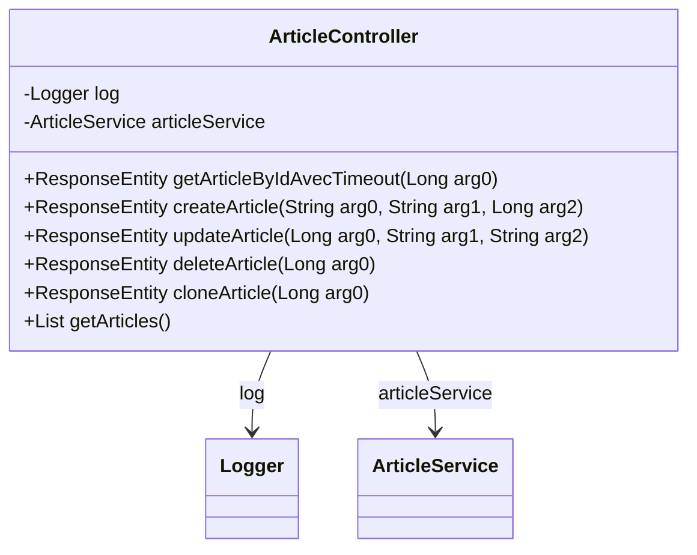

# ArticleController

API de gestion des articles permettant de :
- Lister tous les articles
- Récupérer un article par son ID (avec timeout de 2 secondes)
- Créer un nouvel article associé à un auteur
- Mettre à jour le contenu d'un article
- Supprimer un article
- Cloner un article existant

Chaque article possède un titre, un contenu et est associé à un auteur.
Les opérations de lecture sont optimisées avec des timeouts pour garantir la réactivité.

## Diagramme de Classe

## Methods

### getArticleByIdAvecTimeout

#### Parameters

- `id` : ID de l'article à récupérer

#### Responses

- `200` : Article trouvé
- `404` : Article non trouvé
- `408` : Délai d'attente dépassé
- `500` : Erreur interne du serveur

### createArticle

#### Parameters

- `title` : Titre de l'article
- `content` : Contenu de l'article
- `authorId` : ID de l'auteur

#### Responses

- `201` : Article créé avec succès
- `400` : Données invalides
- `404` : Auteur non trouvé
- `500` : Erreur interne du serveur

### updateArticle

#### Parameters

- `id` : ID de l'article à mettre à jour
- `title` : Nouveau titre de l'article
- `content` : Nouveau contenu de l'article

#### Responses

- `200` : Article mis à jour avec succès
- `404` : Article non trouvé
- `500` : Erreur interne du serveur

### deleteArticle

#### Parameters

- `id` : ID de l'article à supprimer

#### Responses

- `204` : Article supprimé avec succès
- `404` : Article non trouvé
- `500` : Erreur interne du serveur

### cloneArticle

#### Parameters

- `id` : ID de l'article à cloner

#### Responses

- `201` : Article cloné avec succès
- `404` : Article non trouvé
- `500` : Erreur interne du serveur

### getArticles

#### Responses

- `200` : Liste des articles récupérée avec succès
- `500` : Erreur interne du serveur

