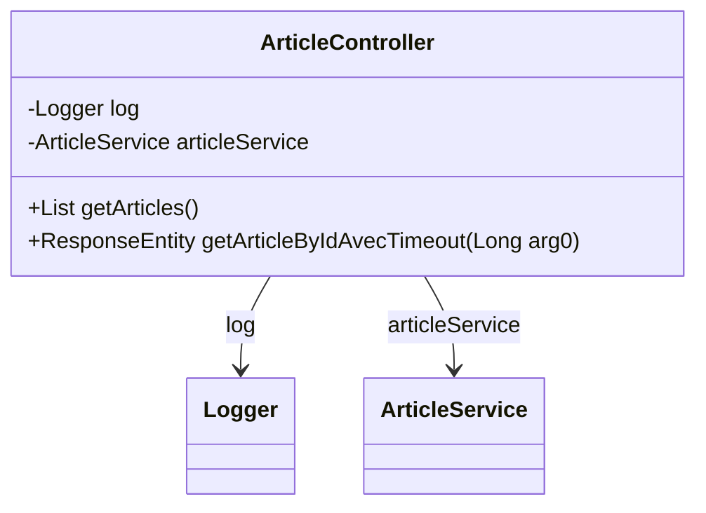

# ArticleController

API de gestion des articles

## Diagramme de Classe

## Methods

### getArticles

#### Responses

- `200` : Liste des articles récupérée avec succès
- `500` : Erreur interne du serveur

### getArticleByIdAvecTimeout

#### Parameters

- `arg0` : ID de l'article à récupérer

#### Responses

- `200` : Article trouvé
- `404` : Article non trouvé
- `408` : Délai d'attente dépassé
- `500` : Erreur interne du serveur

