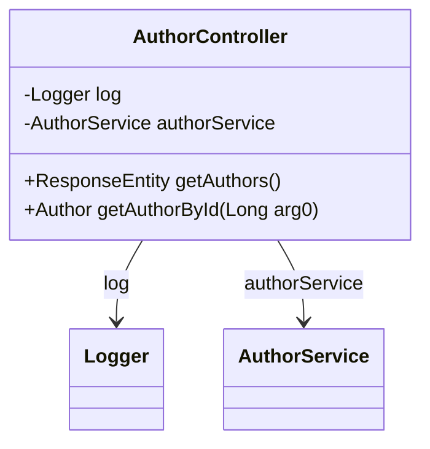

# AuthorController

API de gestion des auteurs

## Diagramme de Classe

## Methods

### getAuthors

#### Responses

- `200` : Liste des auteurs récupérée avec succès
- `404` : Auteurs non trouvés
- `500` : Erreur interne du serveur

### getAuthorById

#### Parameters

- `arg0` : ID de l'auteur à récupérer

#### Responses

- `200` : Auteur trouvé
- `404` : Auteur non trouvé
- `500` : Erreur interne du serveur

