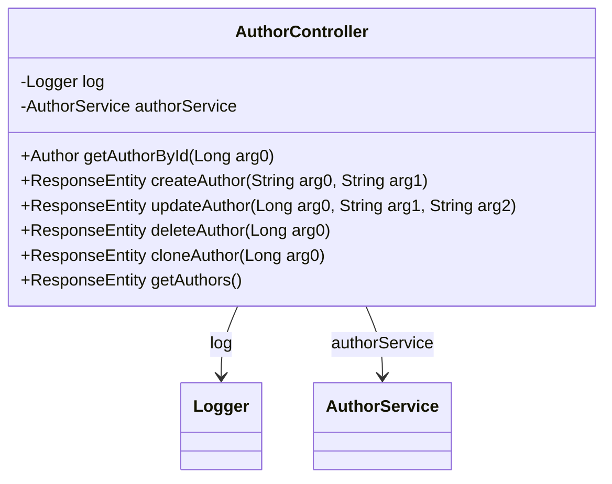

# AuthorController

API de gestion des auteurs permettant de :
- Lister tous les auteurs
- Récupérer un auteur par son ID
- Créer un nouvel auteur
- Mettre à jour les informations d'un auteur
- Supprimer un auteur
- Cloner un auteur existant

Chaque auteur possède un nom, une biographie et peut être associé à plusieurs articles.

## Diagramme de Classe

## Methods

### getAuthorById

**Résumé :** Récupérer un auteur par ID

**Description :** Récupère les informations détaillées d'un auteur spécifique en utilisant son identifiant unique. Inclut son nom, sa biographie et la liste de ses articles.

#### Parameters

- `id` : ID de l'auteur à récupérer

#### Responses

- `200` : Auteur trouvé
- `404` : Auteur non trouvé
- `500` : Erreur interne du serveur

### createAuthor

**Résumé :** Créer un nouvel auteur

**Description :** Crée un nouvel auteur dans le système avec les informations fournies. L'auteur sera immédiatement disponible pour être associé à des articles.

#### Parameters

- `name` : Nom de l'auteur
- `bio` : Biographie de l'auteur

#### Responses

- `201` : Auteur créé avec succès
- `400` : Données invalides
- `500` : Erreur interne du serveur

### updateAuthor

**Résumé :** Mettre à jour un auteur

**Description :** Met à jour les informations d'un auteur existant. Toutes les modifications sont appliquées immédiatement et affectent tous les articles associés.

#### Parameters

- `id` : ID de l'auteur à mettre à jour
- `name` : Nouveau nom de l'auteur
- `bio` : Nouvelle biographie de l'auteur

#### Responses

- `200` : Auteur mis à jour avec succès
- `404` : Auteur non trouvé
- `500` : Erreur interne du serveur

### deleteAuthor

**Résumé :** Supprimer un auteur

**Description :** Supprime définitivement un auteur du système. Cette action supprime également tous les articles associés à cet auteur.

#### Parameters

- `id` : ID de l'auteur à supprimer

#### Responses

- `204` : Auteur supprimé avec succès
- `404` : Auteur non trouvé
- `500` : Erreur interne du serveur

### cloneAuthor

**Résumé :** Cloner un auteur

**Description :** Crée une copie exacte d'un auteur existant. Le clone aura les mêmes informations que l'auteur original mais un nouvel ID unique.

#### Parameters

- `id` : ID de l'auteur à cloner

#### Responses

- `201` : Auteur cloné avec succès
- `404` : Auteur non trouvé
- `500` : Erreur interne du serveur

### getAuthors

**Résumé :** Récupérer tous les auteurs

**Description :** Récupère la liste complète des auteurs disponibles dans le système. Retourne une liste vide si aucun auteur n'est trouvé.

#### Responses

- `200` : Liste des auteurs récupérée avec succès
- `404` : Auteurs non trouvés
- `500` : Erreur interne du serveur

