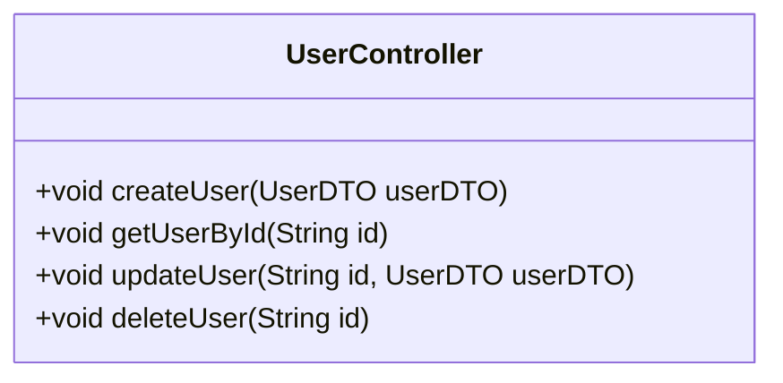

# UserController

Contrôleur REST pour la gestion des utilisateurs. Ce contrôleur permet de créer, récupérer, mettre à jour et supprimer des utilisateurs.

## Diagramme de Classe

## Methods

### createUser

Crée un nouvel utilisateur dans le système. L'utilisateur doit fournir un email valide et un mot de passe respectant les critères de sécurité.

#### Parameters

- `userDTO` : Données de l'utilisateur à créer, incluant email et mot de passe

#### Responses

- `200` : L'utilisateur créé avec son identifiant unique
- `400` : L'email fourni n'est pas valide
- `400` : Le mot de passe ne respecte pas les critères de sécurité
- `409` : Un utilisateur avec cet email existe déjà

### getUserById

Récupère les informations d'un utilisateur à partir de son identifiant unique. Retourne une erreur 404 si l'utilisateur n'existe pas.

#### Parameters

- `id` : Identifiant unique de l'utilisateur

#### Responses

- `200` : Les informations complètes de l'utilisateur
- `404` : L'utilisateur n'a pas été trouvé

### updateUser

Met à jour les informations d'un utilisateur existant. Seuls les champs fournis seront mis à jour, les autres resteront inchangés.

#### Parameters

- `id` : Identifiant unique de l'utilisateur
- `userDTO` : Données à mettre à jour

#### Responses

- `200` : L'utilisateur mis à jour
- `404` : L'utilisateur n'a pas été trouvé
- `400` : Le nouvel email n'est pas valide

### deleteUser

Supprime un utilisateur du système. Cette action est irréversible et supprimera toutes les données associées à l'utilisateur.

#### Parameters

- `id` : Identifiant unique de l'utilisateur

#### Responses

- `200` : Confirmation de la suppression
- `404` : L'utilisateur n'a pas été trouvé
- `500` : Impossible de supprimer l'utilisateur